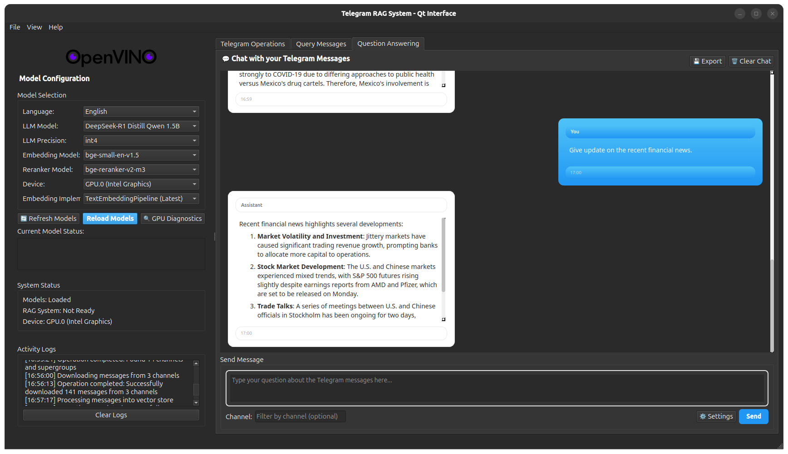

<div align="center">


# OpenVINO Messenger AI‑Assistant


Private, local‑first Telegram RAG assistant with OpenVINO acceleration and a cross-platform desktop native Qt interface.

[Releases](https://github.com/siddhant-0707/openvino_messenger_assistant/releases) · [Docs](./docs/ARCHITECTURE.md) · [Medium](https://medium.com/openvino-toolkit/draft-work-in-progress-30b29ed4f8b2)



</div>

## Highlights

- Local, private inference with OpenVINO (NPU/GPU/CPU/AUTO)
- Desktop‑grade UX with Qt (streaming, markdown, diagnostics)
- One‑click executables for Windows and Linux
- Fast RAG with FAISS, BGE embeddings, optional reranking
- Dynamic model discovery from curated OpenVINO collections

## Download

Grab the latest Windows and Linux builds from [GitHub Releases](https://github.com/siddhant-0707/openvino_messenger_assistant/releases) and run `TelegramRAG`.

## Quickstart (From Source)

```bash
git clone https://github.com/siddhant-0707/openvino_messenger_assistant
cd openvino_messenger_assistant
python3 -m venv .venv && source .venv/bin/activate  # Windows: .venv\Scripts\activate
python -m pip install --upgrade pip
pip install -e .

# Create .env with your Telegram API credentials
cp env.example .env  # then edit values

# Run Qt desktop app (recommended)
python run_qt_app.py

# Or run the web interface
python examples/telegram_rag_gradio.py  # http://localhost:7860
```

## Features

### Retrieval‑Augmented Generation

- Chunking with metadata preservation
- BGE embeddings (OpenVINO TextEmbeddingPipeline)
- FAISS vector store; optional OpenVINO reranker
- LangChain RAG chains with model‑aware prompts

### Desktop Experience (Qt)

- Streaming responses with markdown rendering
- Model/device management, GPU diagnostics, progress/error panels
- Dockable layout, theming, activity logs

### Telegram Integration

- Telethon‑based ingestion with session persistence
- Channel discovery, time‑window filters, per‑channel limits
- JSON exports saved under `data/telegram_data/`

## Architecture

See the full overview in [`docs/ARCHITECTURE.md`](./docs/ARCHITECTURE.md). Key components:

- Ingestion: Telethon flows and JSON export
- Processing: chunking → embeddings → FAISS index
- Querying: retrieval → (optional rerank) → LLM generation
- UI: Qt desktop app and optional Gradio web

## Troubleshooting

### GPU/NPU memory

- If you see OpenCL errors or OOM: switch to CPU, use smaller models, or reduce tokens
- Ensure up‑to‑date drivers and OpenVINO runtime

### Login issues (Telegram)

- Delete the session file if corrupted (`telegram_session.session`) and retry login
- Verify API credentials and two‑factor settings

## Roadmap

- Plugins for additional data sources
- Multi‑modal retrieval (images/documents)
- CI builds and PyPI package

## Credits

Built with: OpenVINO, Qt (PySide6), Telethon, FAISS, LangChain.

GSoC 2025 project under the OpenVINO Toolkit.