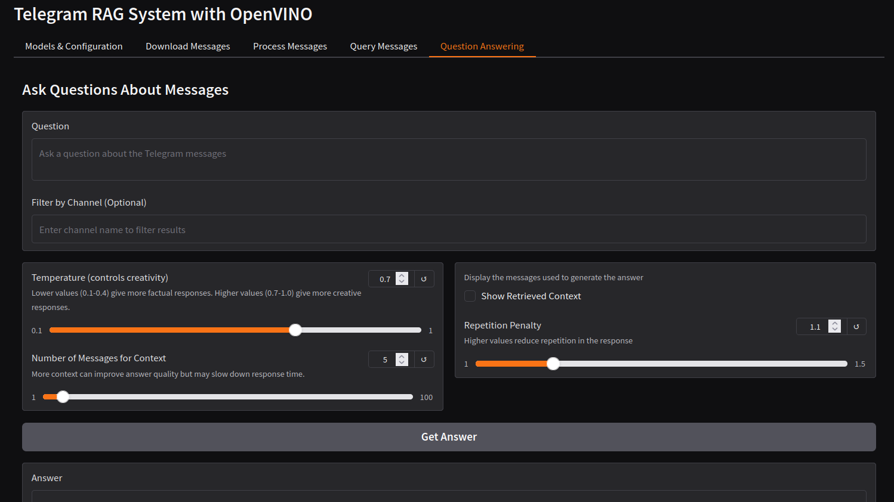

## Telegram Integration

To use the Telegram integration functionality, follow these steps:

1. Set up your Python environment as described in the [OpenVINO Notebooks Wiki](https://github.com/openvinotoolkit/openvino_notebooks/wiki).

2. Create a Telegram Application:
   - Go to [https://my.telegram.org/apps](https://my.telegram.org/apps)
   - Log in with your Telegram account
   - Create a new application if you haven't already
   - Note down your `api_id` and `api_hash`

3. Create a `.env` file in the root directory with the following content:
   ```
   TELEGRAM_API_ID=your_api_id
   TELEGRAM_API_HASH=your_api_hash
   ```
   Replace `your_api_id` and `your_api_hash` with the values from step 2.

4. Run the Integration:
   - Launch the Gradio interface by running: `python telegram_rag_gradio.py`
   - Or explore the functionality in the `telegram_rag_example.ipynb` notebook

Note: Keep your `api_id` and `api_hash` confidential and never share them publicly.

### Sample Screenshot

