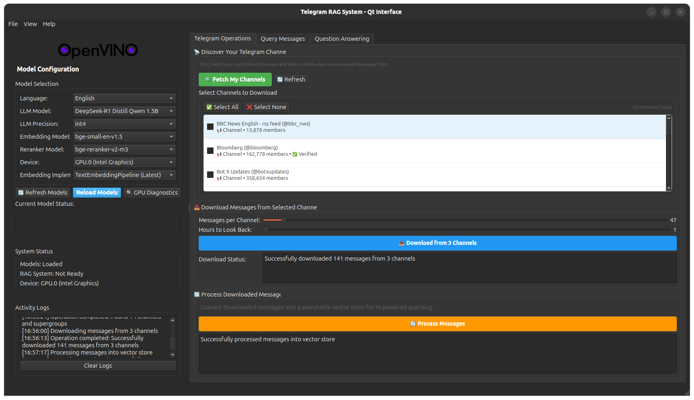
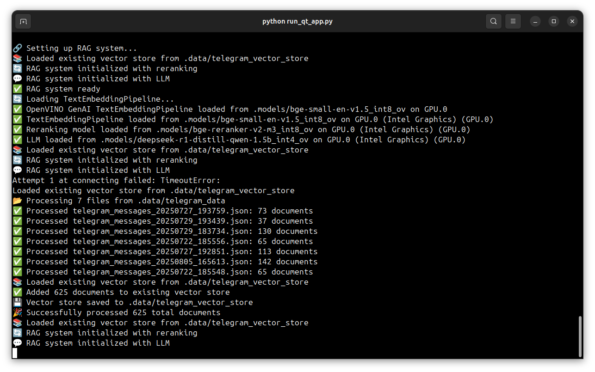
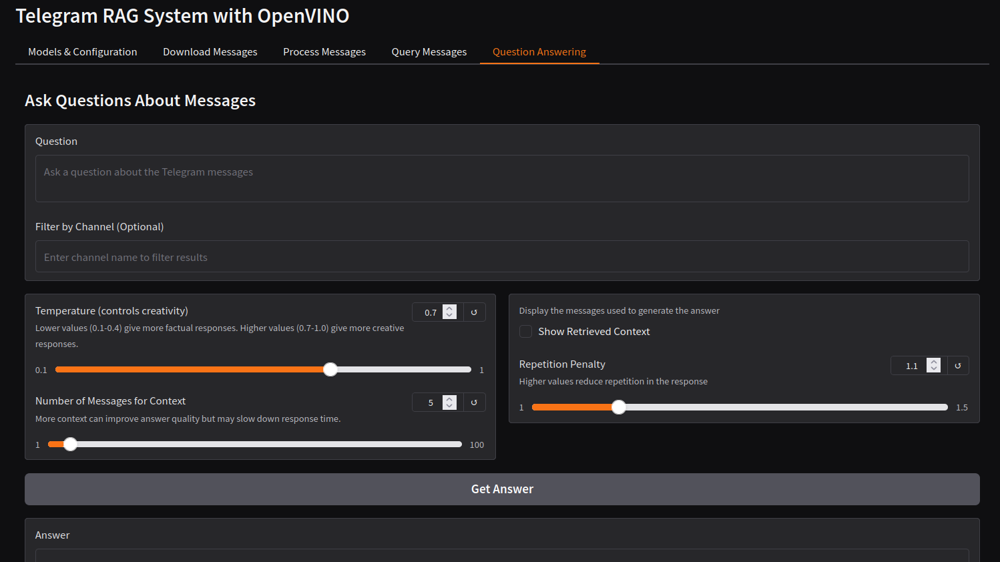

## Setup and Installation

### **Method 1: PyPI Package (Recommended)**

```bash
# Install from PyPI (when available)
pip install openvino-messenger-assistant
```

### **Method 2: From Source**

1. **Clone the Repository**
   ```bash
   git clone https://github.com/siddhant-0707/openvino_messenger_assistant
   cd openvino_messenger_assistant
   ```

2. **Create a Virtual Environment**
   ```bash
   python3 -m venv openvino_env
   ```

3. **Activate the Environment**
   ```bash
   source openvino_env/bin/activate  # Linux/Mac
   # or
   openvino_env\Scripts\activate     # Windows
   ```

4. **Install the Package**
   ```bash
   python -m pip install --upgrade pip
   pip install -e .
   ```

### **Method 3: Docker**

```bash
# Pull and run the Docker image (when available)
docker run -it openvino-messenger-assistant:1.0.0

# Or build from source
docker build -t openvino-messenger-assistant .
docker run -it openvino-messenger-assistant
```

### **Method 4: Download Executable**

1. Go to [Releases](https://github.com/siddhant-0707/openvino_messenger_assistant/releases)
2. Download the latest executable for your platform
3. Extract and run `TelegramRAG` (Qt interface) or `TelegramRAG-Web` (Gradio interface)

## OpenVINO Model Integration

This application automatically downloads optimized OpenVINO models from Hugging Face. The models are:

- **LLM Models**: Downloaded from the [OpenVINO LLM collection](https://huggingface.co/collections/OpenVINO/llm-6687aaa2abca3bbcec71a9bd) (INT4 quantized)
- **Embedding Models**: Downloaded from individual [OpenVINO repositories](https://huggingface.co/OpenVINO) (INT8 quantized)
- **Reranking Models**: Downloaded from individual [OpenVINO repositories](https://huggingface.co/OpenVINO) (INT8 quantized)

All models are:
- **Pre-optimized** with INT4/INT8 quantization for better performance
- **Automatically downloaded** when first needed
- **Cached locally** for subsequent use

No manual model conversion is required! The application will download the appropriate models on first run.

## Telegram Integration

To use the Telegram integration functionality, follow these steps:

1. **Create a Telegram Application:**
   - Go to [https://my.telegram.org/apps](https://my.telegram.org/apps)
   - Log in with your Telegram account
   - Create a new application if you haven't already
   - Note down your `api_id` and `api_hash`

2. **Create a `.env` file** in the root directory with the following content:
   ```
   TELEGRAM_API_ID=your_api_id
   TELEGRAM_API_HASH=your_api_hash
   ```
   Replace `your_api_id` and `your_api_hash` with the values from step 1.

3. **Run the Application:**
   
   **Qt Desktop Application (Recommended):**
   ```bash
   python run_qt_app.py
   ```
   
   **Gradio Web Interface:**
   ```bash
   python examples/telegram_rag_gradio.py
   ```
   Available at `http://localhost:7860`
   
   **Jupyter Notebook:**
   - Explore the functionality in `examples/telegram_rag_example.ipynb`

**Note:** Keep your `api_id` and `api_hash` confidential and never share them publicly.

## Interface Options

### Qt Desktop Application Features

The Qt for Python interface ([documentation](https://doc.qt.io/qtforpython-6/)) provides a professional desktop experience with:

- **Modern Desktop UI**: Native Qt6 widgets with professional appearance
- **Real-time Streaming**: Enhanced streaming responses with better performance  
- **Advanced Layout**: Resizable panels, dockable windows, and customizable interface
- **Background Operations**: Non-blocking downloads and processing with progress tracking
- **Visual Model Management**: Real-time model status, GPU diagnostics, and memory monitoring
- **Dark/Light Themes**: Automatic theme switching with system integration
- **Activity Logging**: Comprehensive logging panel for debugging and monitoring
- **Enhanced Performance**: Better memory management and threading for desktop use

### Gradio Web Interface Features

The web interface provides browser-based access with:
- **Tabbed Interface**: Organized tabs for different operations
- **Web Accessibility**: Access from any device with a web browser
- **Streaming Support**: Real-time response generation
- **Model Configuration**: Dynamic model selection and device management

### GPU Support & Troubleshooting

The application supports GPU acceleration with Intel and NVIDIA GPUs through OpenVINO. However, GPU memory limitations can cause issues with larger models.

#### Common GPU Issues

**CL_EXEC_STATUS_ERROR_FOR_EVENTS_IN_WAIT_LIST Error**
- **Cause**: GPU running out of memory or OpenCL driver issues
- **Solutions**:
  - Switch to CPU device in model configuration
  - Use smaller models (DeepSeek-R1-Distill-Qwen-1.5B instead of 3B+ models)
  - Reduce `max_new_tokens` to 256-512
  - Close other GPU applications
  - Restart the application

### Available Models

The application dynamically fetches and displays all available models from OpenVINO repositories:

- **LLM Models**: Automatically discovered from the [OpenVINO LLM collection](https://huggingface.co/collections/OpenVINO/llm-6687aaa2abca3bbcec71a9bd)
  - Qwen 2.5 series (0.5B, 1.5B, 3B, 7B, 14B)
  - Phi-3.5 and Phi-4 models
  - Gemma-2, TinyLlama, Mistral, Neural-Chat
  - DeepSeek-R1 models
  - Available in INT4, INT8, and FP16 precisions
  
- **Embedding Models**: BGE-small, BGE-large, BGE-M3 (INT8 quantized)  
- **Reranking Models**: BGE-reranker variants (INT8 quantized)

**Features:**
- 🔄 **Dynamic Model Discovery**: Automatically fetches the latest available models
- 🎯 **Precision Selection**: Choose between INT4, INT8, and FP16 based on availability
- 📊 **User-Friendly Names**: Models displayed with readable names (e.g., "Qwen 2.5 3B Instruct")
- ⚡ **Automatic Download**: Models downloaded on-demand when selected

All models are automatically downloaded from their respective Hugging Face repositories when selected.

### Manual Model Conversion (Optional)

If you want to convert models manually or experiment with different settings, you can still use the Jupyter notebooks:

- `telegram_rag_example.ipynb`: Complete example with Telegram integration
- `llm-rag-langchain.ipynb`: General RAG implementation
- `llm-rag-langchain-genai.ipynb`: RAG with OpenVINO GenAI

The notebooks include options for both automatic model downloading and manual conversion using `optimum-cli`.

### Sample Screenshots




