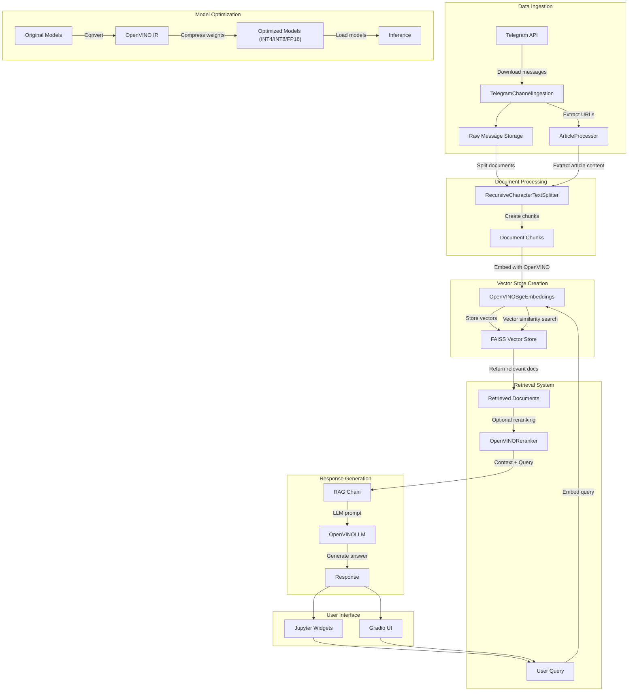

# Telegram RAG System Architecture

This document describes the architecture of the Telegram Retrieval-Augmented Generation (RAG) system built with OpenVINO optimized models and LangChain.

## System Overview

The Telegram RAG system is designed to download, process, index, and query messages from Telegram channels, enabling users to search and ask questions about the content. The system uses OpenVINO-optimized models for embedding, reranking, and language generation, with options for model quantization to improve performance on various hardware.

## Core Components

### 1. Data Ingestion

- **TelegramChannelIngestion**: Connects to the Telegram API using user credentials to download messages from specified channels.
- **ArticleProcessor**: Extracts and processes article content from URLs found in messages.
- Messages are stored with metadata (channel, date, message ID) for context preservation.

### 2. Document Processing

- **Text Splitting**: Messages and article content are split into manageable chunks using `RecursiveCharacterTextSplitter`.
- Default configuration: 500-character chunks with 50-character overlap.
- Metadata is preserved during chunking to maintain traceability.

### 3. Vector Store Creation

- **OpenVINOBgeEmbeddings**: An optimized embedding model (e.g., bge-small-en-v1.5) using OpenVINO for hardware acceleration.
- **FAISS Vector Store**: High-performance vector database for storing and searching embeddings.
- Embeddings are normalized and optimized for similarity search.

### 4. Retrieval System

- **Query Processing**: User questions are embedded using the same embedding model.
- **Vector Similarity Search**: FAISS retrieves semantically similar document chunks.
- **OpenVINOReranker**: Optional reranking step to improve retrieval quality using a cross-encoder model.
- **Filtering**: Support for filtering by channel name and other metadata.

### 5. Response Generation

- **OpenVINOLLM**: Language model optimized with OpenVINO for response generation.
- **RAG Chain**: Combines retrieved context with user query to generate an informed response.
- **Prompt Templates**: Customized prompts based on the selected language model.

### 6. Model Optimization

- **Model Conversion**: Models are converted from original formats to OpenVINO IR.
- **Weight Compression**: Options for INT4, INT8, or FP16 precision to optimize for different hardware targets.
- **Device Selection**: Models can be run on CPU, GPU, or AUTO (automatic device selection).

### 7. User Interface

- **Jupyter Notebook UI**: Interactive widgets for model selection, data ingestion, and querying.
- **Gradio UI**: Optional web interface for more user-friendly interaction.

## Model Selection and Configuration

The system supports multiple models for different components:

1. **LLM Models**: Various sizes and languages (e.g., qwen2.5-3b-instruct)
2. **Embedding Models**: Options like bge-small-en-v1.5, bge-large-en-v1.5
3. **Reranking Models**: Options like bge-reranker-v2-m3, bge-reranker-large

Models can be configured for different languages (English, Chinese, Japanese) and optimized for different hardware targets.

## Performance Optimization

- **Model Quantization**: INT4/INT8 compression reduces memory usage and improves inference speed.
- **Device Targeting**: Models can run on CPU, GPU, or NPU based on hardware availability.
- **Batch Processing**: Embedding model supports batched inference for higher throughput.

## Usage Flow

1. Configure Telegram API credentials
2. Select and convert models
3. Download messages from selected Telegram channels
4. Process messages into vector store
5. Query messages or ask questions using the RAG system
6. Receive responses generated based on relevant message content

## Extensibility

The architecture is modular and can be extended in various ways:

- Support for additional messaging platforms
- Integration with other data sources
- Custom post-processing of retrieved documents
- Advanced filtering and sorting options
- Streaming responses for better user experience 